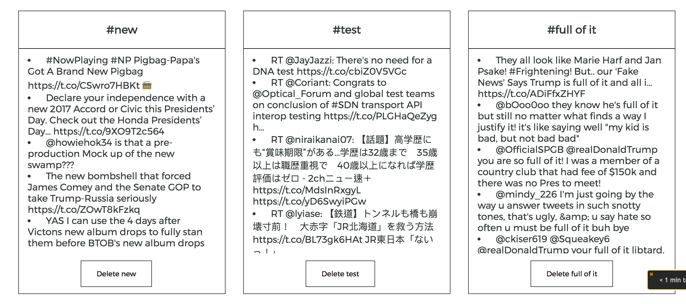

Alt Legal Code Challenge
===

# Instructions
1. In the root direct, run `npm install` to install dependencies.

2. You will need to make a `_config.js` file in the root directory with this code:
`var ids = {
  twitter: {
    consumerKey: consumerKey,
    consumerSecret: consumerSecret,
    accessToken:  accessToken,
    accessTokenSecret: accessTokenSecret,
    callbackURL: "http://127.0.0.1:3000/auth/twitter/callback"
  }
};
module.exports = ids;`

You will have to input your own keys, or I can send you the `_config.js` file.

3. Run `mongod` in terminal first. The application will create a DB named altlegal upon starting the server.

4. Run `node server.js` or `nodemon server.js`

5. Visit localhost:3001 to start the app!

###Note: Speeds may vary, but the application definitely works
###It does not do auto login, so you will have to login twice with the twitter auth

